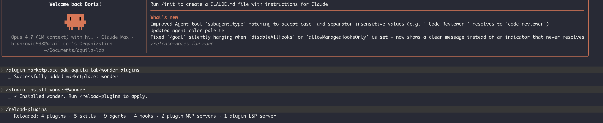

# Wonder agent plugins

Use [Wonder](https://wonder.design) with your favorite coding agent. Pick your agent below and run the install command.

## Install

### Cursor

```sh
/add-plugin wonder
```

### Claude Code



1. Open your terminal and run `claude` to start Claude Code.
2. Add the marketplace:

   ```sh
   /plugin marketplace add aquila-lab/wonder-plugins
   ```

3. Install the plugin:

   ```sh
   /plugin install wonder@wonder
   ```

4. Reload to activate it:

   ```sh
   /reload-plugins
   ```

5. Open the [Wonder](https://wonder.design) app and open any canvas file you want the generations drawn to. Then, back in Claude Code, type a prompt like:

   ```
   Generate a purple button in Wonder
   ```

   Watch it draw onto your canvas in real time.

### Codex

```sh
/create-plugin wonder
```

Pulls from the `aquila-lab/wonder-plugins` marketplace.

## How it works

The plugin connects your agent to the Wonder MCP server at `https://mcp.wonder.so/mcp`. On first use you'll sign in through a standard OAuth flow — no API keys to manage, and tokens refresh automatically.

## Missing your agent?

[Open an issue](https://github.com/aquila-lab/wonder-plugins/issues/new) and we'll add it.

## License

[MIT](./LICENSE)
