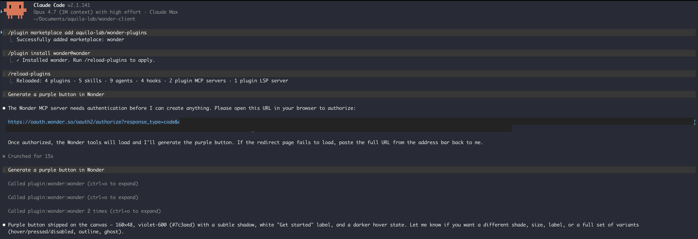
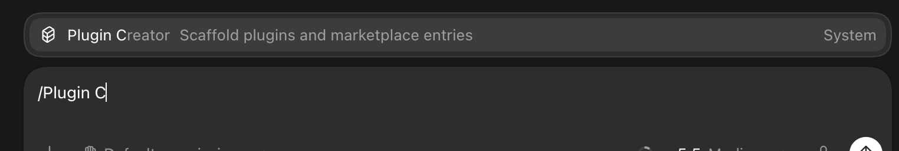
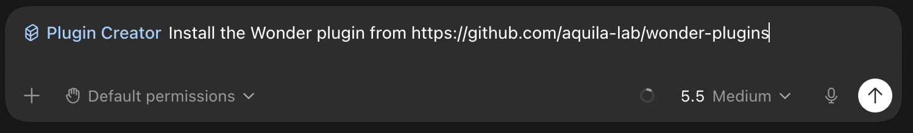

# Wonder agent plugins

Use [Wonder](https://wonder.design) with your favorite coding agent. Pick your agent below and run the install command.

## Install

### Cursor

1. Open Cursor and open the chat panel.
2. Install the plugin by typing:

   ```sh
   /add-plugin wonder
   ```

3. Open the [Wonder](https://wonder.design) app and open any canvas file you want the generations drawn to. Then, back in Cursor, type a prompt like:

   ```
   Generate a purple button in Wonder
   ```

4. On first use, Cursor will say the Wonder MCP needs authentication and show a URL. Open it in your browser to authorize, then come back to Cursor and re-send the same prompt. Watch it draw onto your canvas in real time.

### Claude Code

1. Open your terminal and run `claude` to start Claude Code.
2. Add the marketplace:

   ```sh
   /plugin marketplace add aquila-lab/wonder-plugins
   ```

3. Install the plugin:

   ```sh
   /plugin install wonder@wonder
   ```

4. Reload to activate it:

   ```sh
   /reload-plugins
   ```

5. Open the [Wonder](https://wonder.design) app and open any canvas file you want the generations drawn to. Then, back in Claude Code, type a prompt like:

   ```
   Generate a purple button in Wonder
   ```

6. On first use, Claude will say the Wonder MCP needs authentication and print a URL. Open that link in your browser to authorize, then come back to Claude Code and re-send the same prompt. Watch it draw onto your canvas in real time.



### Codex

1. Open Codex.
2. In the prompt box, start typing `/plugin` and pick **Plugin Creator** from the command picker.

   

3. Fill in the rest of the prompt with this repo's URL and send it:

   ```
   Install the Wonder plugin from https://github.com/aquila-lab/wonder-plugins
   ```

   

4. Open the [Wonder](https://wonder.design) app and open any canvas file you want the generations drawn to. Then, back in Codex, type a prompt like:

   ```
   Generate a purple button in Wonder
   ```

5. On first use, Codex will say the Wonder MCP needs authentication and show a URL. Open it in your browser to authorize, then come back to Codex and re-send the same prompt. Watch it draw onto your canvas in real time.

## How it works

The plugin connects your agent to the Wonder MCP server at `https://mcp.wonder.so/mcp`. On first use you'll sign in through a standard OAuth flow - no API keys to manage, and tokens refresh automatically.

## Missing your agent?

[Open an issue](https://github.com/aquila-lab/wonder-plugins/issues/new) and we'll add it.

## License

[MIT](./LICENSE)
