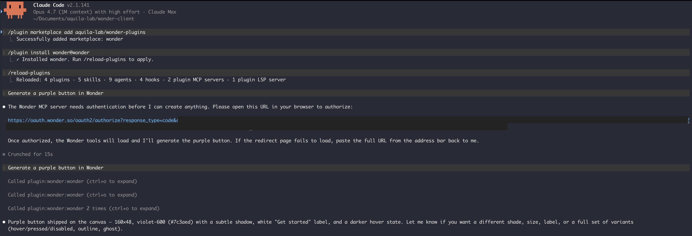

# Wonder plugins

Create and edit designs with your coding agent on a canvas where every design is real code. Wonder plugins are available for Cursor, Claude Code, and Codex.

## Install

### Cursor

1. Open **Customize** in the Cursor sidebar.
2. Search for **Wonder**, select **Install**, and choose a user or project scope.

3. In Cursor, type a prompt like this, with the name of one of your Wonder files:

   ```
   Generate a purple button in my Wonder file "Landing page"
   ```

   The Wonder app doesn't need to be open. Your agent finds the file and works on it in the background.

4. On first use, Cursor will say the Wonder MCP needs authentication and show a URL. Open it in your browser to authorize, then come back to Cursor and re-send the same prompt. Open the file in [Wonder](https://wonder.design) to see the result, or keep it open to watch it draw in real time.

### Claude Code

1. Open your terminal and run `claude` to start Claude Code.
2. Add the marketplace:

   ```sh
   /plugin marketplace add aquila-lab/wonder-plugins
   ```

3. Install the plugin:

   ```sh
   /plugin install wonder@wonder
   ```

4. Reload to activate it:

   ```sh
   /reload-plugins
   ```

5. In Claude Code, type a prompt like this, with the name of one of your Wonder files:

   ```
   Generate a purple button in my Wonder file "Landing page"
   ```

   The Wonder app doesn't need to be open. Claude finds the file and works on it in the background.

6. On first use, Claude will say the Wonder MCP needs authentication and print a URL. Open that link in your browser to authorize, then come back to Claude Code and re-send the same prompt. Open the file in [Wonder](https://wonder.design) to see the result, or keep it open to watch it draw in real time.



### Codex

1. With the Codex CLI installed, add the Wonder marketplace from your terminal:

   ```sh
   codex plugin marketplace add aquila-lab/wonder-plugins
   ```

2. Install the plugin:

   ```sh
   codex plugin add wonder@wonder
   ```

3. Restart Codex and start a new chat. Type `@wonder` and select the installed Wonder plugin. The **Wonder · Computer use** entry starts desktop automation.

4. Send this read-only connection check in Codex. The Wonder app doesn't need to be open:

   ```
   Use Wonder MCP to list my Wonder files without changing anything. If MCP is unavailable or authentication fails, stop and explain how to connect it. Do not use computer use.
   ```

5. Complete Wonder sign-in when Codex prompts you, then retry the connection check. Confirm Codex calls a Wonder MCP tool and returns your Wonder files before asking it to edit a design.

The bundled `wonder-design` skill guides Codex to use Wonder MCP for canvas operations and explain connection problems. Computer use requires an explicit user request. This guidance applies when the skill loads; app picker behavior and global tool routing are controlled by Codex.

## How it works

The plugin connects your agent directly to Wonder. It can inspect existing designs, components, variables, and documentation, create new screens and flows, and edit designs in place, in any Wonder file you can reach. Because every Wonder design is real HTML and CSS, your agent works with the actual structure and styling instead of screenshots or handoff specs.

The Wonder app doesn't need to be open. Wonder's server runs the canvas tools itself, so your agent can read and edit a file in the background. Changes are there the next time you open the file, and they appear live if it's already open.

Wonder MCP uses OAuth, requires no API keys, and is free on every Wonder plan.

## Missing your agent?

[Open an issue](https://github.com/aquila-lab/wonder-plugins/issues/new) and we'll add it.

## License

[MIT](./LICENSE)
